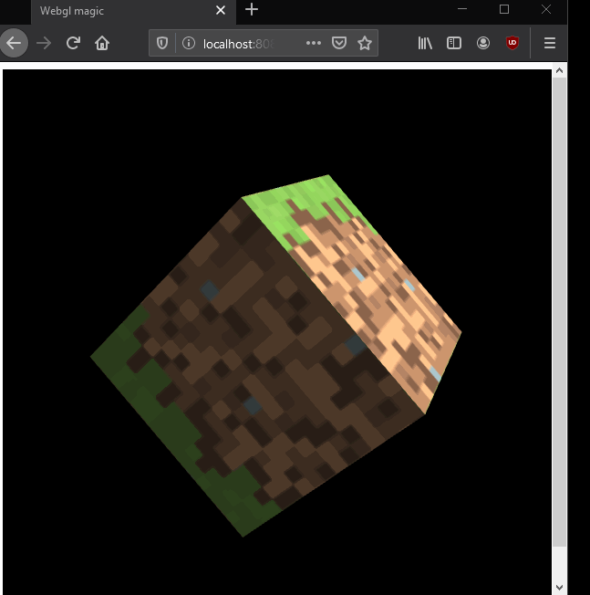

## WebGL playground
This is a little webgl project to learn some basic webgl and have some fun while doing so. :- )

## Current output

## Sources
- [Mozilla webgl tutorial](https://developer.mozilla.org/en-US/docs/Web/API/WebGL_API/Tutorial/Getting_started_with_WebGL)
    -   This was the main source, and a lot of the code is very much copy paste from this awesome tutorial